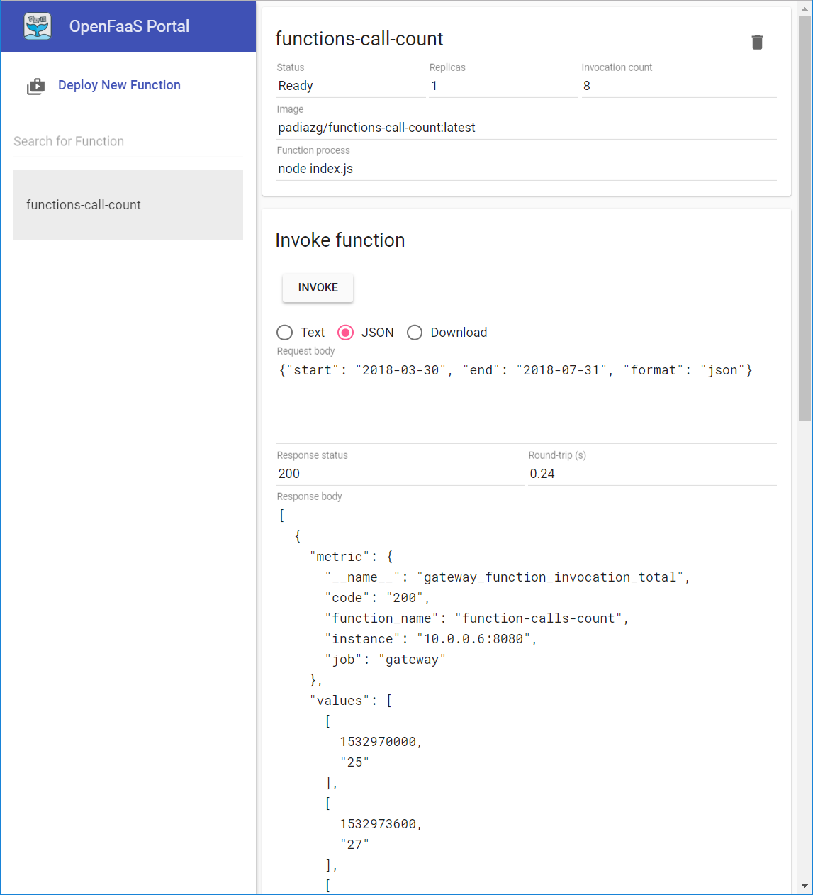

# OpenFaaS - Functions call count per period

After having been using this [this](https://github.com/padiazg/functions-calls-count-cli) CLI project for a while I thought, why not turn it into a function?

> The structure of this project is based on [OpenFaaS with MongoDB] (https://github.com/alexellis/mongodb-function) from [@alexellisuk](https://twitter.com/alexellisuk)

## Build locally

1. Clone this repository
```bash
$ git clone https://github.com/padiazg/of-fn-calls-per-period.git
```
2. Replace "padiazg/" prefix from Docker Hub in stack.yml with your own account

3. Build/deploy
Create new function, make sure to specify ```call-count``` as the name of your function.
```bash
$ faas-cli new call-count --lang node
```
Now you can build/deploy
```bash
faas-cli build && faas-cli deploy
```

## Use directly from Docker Hub
[of-fn-calls-per-period](https://hub.docker.com/r/padiazg/of-fn-calls-per-period/) 
1. Create deploy.yml
```yml
provider:
  name: faas
  gateway: http://127.0.0.1:8080

functions:
  calls-per-period:
    image: padiazg/of-fn-calls-per-period
    environment:
      write_timeout: 10s
      read_timeout: 10s
      prometheus: http://your_prometheus_ip:9090
      timezone: America/Asuncion        # here you sould put your timezone
```
2. Deploy with faas-cli
Deploy your function using faas-cli
```bash
faas-cli deploy
```

## Parameters:
Parameters must be passed in JSON format:  
Examples:  
```json
{"start": "2018-03-30", "end": "2018-07-31"}
{"start": "2018-03-30", "end": "2018-07-31", "format": "json"}
{"start": "2018-03-30", "end": "2018-07-31", "step": "3h", "format": "table"}
```

* **start**: Start day for the query (mandatory).
* **end**: End day for the query (mandatory).
* **step**: Period of time in wich the results are grouped.
* **format**: Format of the output. Defaults to 'table'.  
Posible values are: 
  * table 
  * json

## Examples
Output as ascii-table.  
* Select Text
* Request body: ```{"start": "2018-03-30", "end": "2018-07-31"}```


Output as JSON.  
* Select JSON
* Request body: ```{"start": "2018-03-30", "end": "2018-07-31",  "format": "json"}```

